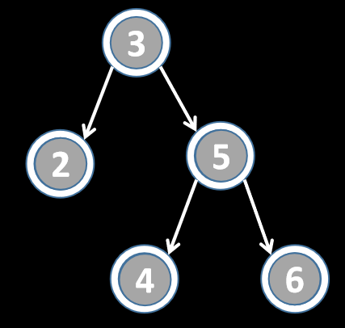
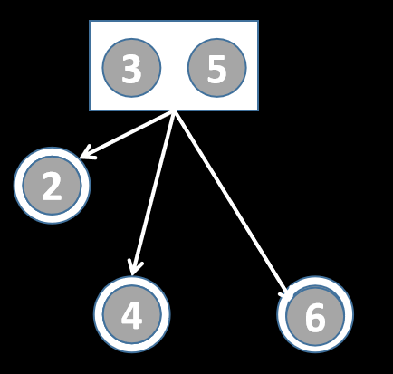
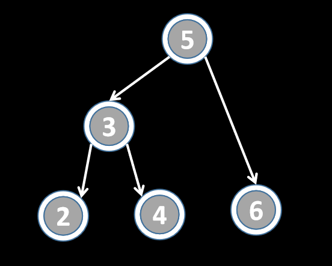

# 旋转

## 引入

### BST的等价性

节点相同的BST本质是等价的，可以通过左旋和右旋操作转化过去。

1. 具有n个节点且相互等价的BST共有(1/2n)*C(2n,n)个
2. 任意两个等价的BST都可以通过至多2n-6次旋转旋过去。

### 旋转示例

旋转操作一般是操作父节点，如图中的节点3，节点3左旋过程可视为三个步骤：

1. “咻~”，节点5向节点3移动
2. “砰!”，节点3和节点5处于同一位置。
3. “呼~”，节点5把节点3踹到左边去。

