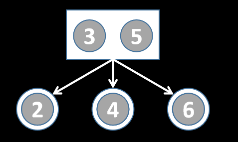
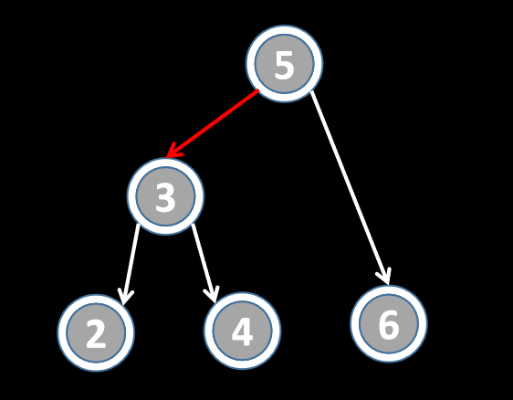

# 将2-3树转化为LLRB左倾红黑树

## 引入

### 问题

2-3树即B树L=3时的情况，始终保证树高为$\Theta(log(n))$，但是2-3树实现起来比较复杂，考虑用BST等价地代替2-3树。

具体操作如下：

1. 所有含1个元素的节点保持不变。
2. 所有含2个元素的节点AB，划分为两个节点，B带一条红色边指向A，A的左右子树为原节点的左中子树，B的右子树为原节点的右子树，如图所示。

### 左偏红黑树

#### 高度

和2-3树对比，每个含2个元素的节点在LLRB中对应一条红色边，于是LLRB的高度最多为H（白色边） + （H + 1）（红色边），等于2H+1，由于H为$\Theta(log(N))$，所以左偏红黑树的高度也为$\Theta(log(N))$。

#### 查找

左偏红黑树（LLRB）本身仍是一棵二分查找树BST，按BST的查找思路去做即可，时间复杂度为$\Theta(N)$。

#### 增加

和2-3树对比分析可知，LLRB添加新元素时，总是满足

1. 红边指向新节点。
2. 出现连续两条红边时，对应2-3树中需要分裂中间节点到父节点去，在LLRB中表现为中间节点旋转，然后将两个子节点的红边与指向自己的白边翻转颜色。

增加操作至多翻转$log(N)$次、翻转$log(N)$次，本身时间复杂度仍然为$\Theta(log(N))$。

### 红黑树

红黑树等价于一棵2-3-4树，也即B树L=4的情况。同样是用BST实现B树，具体实现和操作都比较复杂，考虑的情况也比较多，可以参考专门的教程学习。
